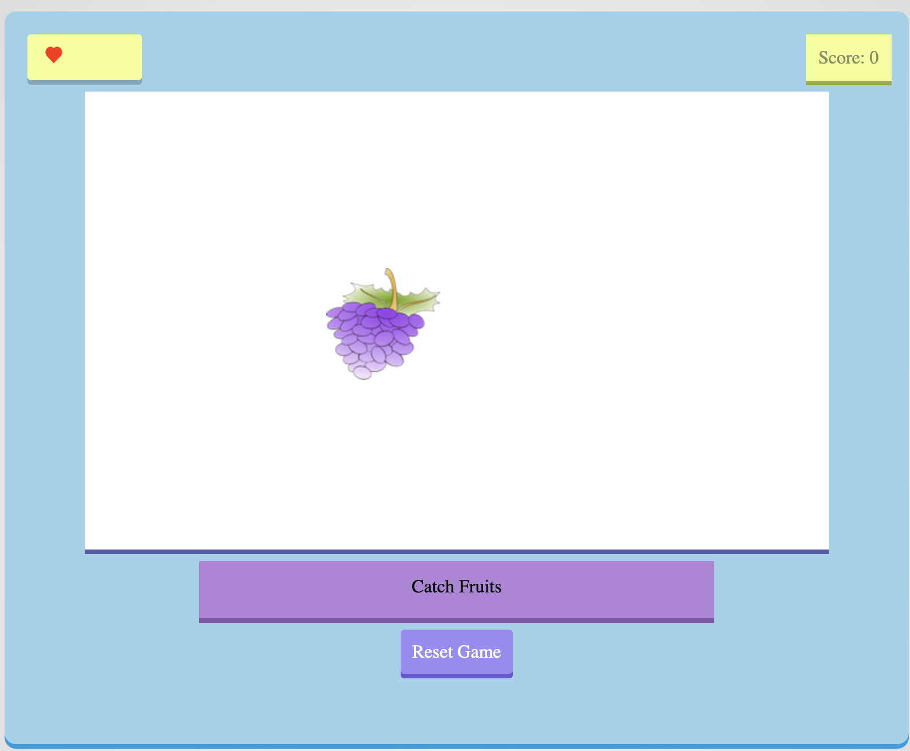

# 🍉 Fruit Game

A fun and interactive browser-based fruit slicing game built using **HTML**, **CSS**, and **JavaScript**. Test your reflexes by slicing falling fruits before they hit the ground!

## 🚀 Features

- Colorful UI and animated fruits
- Score tracking system
- Easy to play with mouse or touchpad
- Lives counter and game over screen

## 🎮 How to Play

1. Click on "Start Game"
2. Slice the fruits by moving your mouse cursor over them
3. Avoid missing 3 fruits — or it's game over!

## 🛠️ Tech Stack

- HTML5
- CSS3
- JavaScript (Vanilla)

## 📸 Screenshot

> If the image doesn’t appear, make sure your `screenshot.png` is in the root folder of the repo.

## 📂 Project Structure

fruit-game/
├── index.html
├── styling.css
├── jquery.js
├── audio
├── images
└── screenshot.png

## 📌 Live Demo

You can try the game locally by opening `index.html` in your browser.

---

### 💡 Author

**Blessed Ogechukwu**  
[GitHub: @luckaty](https://github.com/luckaty)

